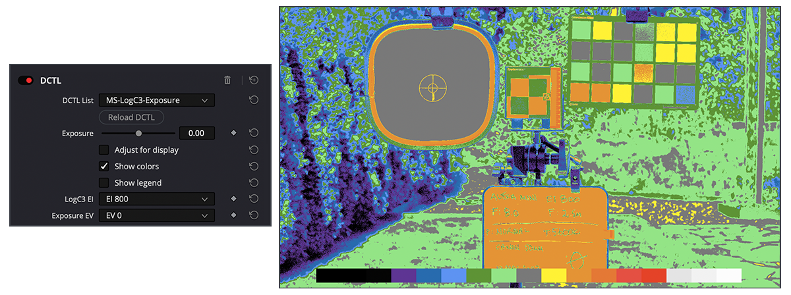
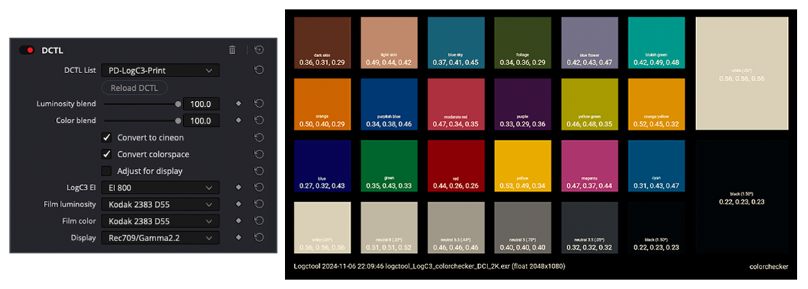
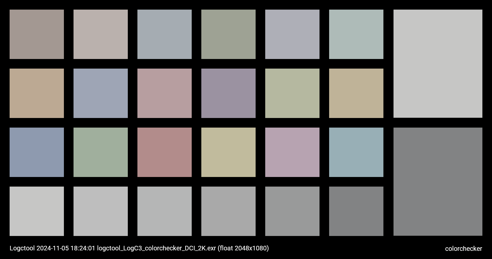

# Photographic DCTLs #

[](https://github.com/mikaelsundell/icloud-snapshot/blob/master/license.md)

- [Photographic DCTLs](#photographic-dctls)
  - [Introduction](#introduction)
  - [Installation and utils](#installation-and-utils)
    - [To open the DCTL readme documentation, use:](#to-open-the-dctl-readme-documentation-use)
    - [Quick install for Windows users](#quick-install-for-windows-users)
    - [DCTL compatibility](#dctl-compatibility)
  - [Verified DCTLs](#verified-dctls)
    - [Cineon color processing](#cineon-color-processing)
      - [Cineon exposure](#cineon-exposure)
      - [Cineon inversion](#cineon-inversion)
      - [ACES scene-linear and calibration curves](#aces-scene-linear-and-calibration-curves)
      - [Cineon exposure](#cineon-exposure-1)
      - [Cineon transform](#cineon-transform)
    - [ARRI LogC color processing](#arri-logc-color-processing)
      - [LogC3 exposure](#logc3-exposure)
      - [LogC3 print](#logc3-print)
      - [LogC3 transform](#logc3-transform)
    - [Blackmagic LogC color processing](#blackmagic-logc-color-processing)
      - [Gen5 transform](#gen5-transform)
    - [Utilities](#utilities)
      - [Stripify](#stripify)
      - [Saturation](#saturation)
  - [Experimental DCTLs](#experimental-dctls)
      - [LogC3 temperature](#logc3-temperature)
      - [Grade](#grade)
  - [DCTLs from other projects](#dctls-from-other-projects)
      - [Printer Lights](#printer-lights)
      - [TetraInterp](#tetrainterp)
      - [TetraInterpHSV](#tetrainterphsv)
  - [Reference charts](#reference-charts)
      - [ACES Macbeth 50D 5203 EXR from rawtoaces](#aces-macbeth-50d-5203-exr-from-rawtoaces)
      - [ARRI LogC3 stepchart - EXR 2K LogC3 encoding](#arri-logc3-stepchart---exr-2k-logc3-encoding)
      - [ARRI LogC3 colorchecker - EXR 2K LogC3 encoding](#arri-logc3-colorchecker---exr-2k-logc3-encoding)
  - [References](#references)
  - [Web Resources](#web-resources)

Introduction
---------


This is a growing collection of DCTLs (DaVinci Color Transform Language) created to understand workflows with ARRI LogC3, Gen5 and Cineon in DaVinci Resolve. These DCTLs take a photographic approach to color correction and grading from log and film negatives, focusing on look adjustments and traditional print techniques rather than rigid technical processes. The project is continually updated to implement new insights and techniques.
  
Installation and utils
---------

To use these tools into your DaVinci Resolve setup, begin by cloning the git repository or download the release package, which contains the DCTLs and headers.

Run `python(.exe) run.py install` in your terminal to copy the `*.dctl` and `*.h` files to the DaVinci Resolve LUT DCTL folder, ensuring they're accessible within your Resolve environment. The files can also be manually copied to `/Library/Application Support/Blackmagic Design/DaVinci Resolve/LUT/DCTL` on Mac and `C:\ProgramData\Blackmagic Design\DaVinci Resolve\Support\LUT\DCTL`on Windows.

For added convenience, the run.py script is provided, enabling easy access to various resources:

### To open the DCTL readme documentation, use:

```shell
./run.py readme
````

**For exploring DCTL examples, execute:**

```shell
./run.py examples
````

**To access the DaVinci Resolve log file and initiate a trace, input:**

```shell
./run.py install
````

**To install *.dctl and *.h into DCTL directory:**

```shell
./run.py log
````

**To make a snapshot of hte DaVinvi Resolve DCTL folder, input:**

```shell
./run.py snapshot
````

### Quick install for Windows users

```shell
./install.bat
````

### DCTL compatibility

All DCTLs are tested and confirmed to work with Metal, CUDA, and OpenCL on both Mac and Windows platforms.

## Verified DCTLs

### Cineon color processing

#### Cineon exposure


Cineon exposure from photographic stops, incorporating a zone based false color to aid in achieving correct exposure levels.

- https://github.com/mikaelsundell/dctl/blob/master/PD-Cineon-Exposure.dctl

#### Cineon inversion


Cineon negative inversion with precise control over the dmin ratio based inversion process using adjustable parameters such as density, bit depth, offset, and density scale. You can specify dmin base values manually as floating-point numbers (obtained from tools like Pixel Analyzer in Nuke or similar software) or sample them using a rectangular sampler from the border or other dmin base areas.

#### ACES scene-linear and calibration curves

To account for the variations of film stock and the use of ECN-2 chemicals, developer time and temperature, camera and lightbox settings - calibration curves are applied to match ideal cineon code values. In this example, photoscanning was used along with the rawtoaces tool to convert the Camera RAW CR2 file to scene-linear ACES, starting with as much information as possible. However, because the science is not exact, manual tweaking using density scaling and calibration curves is needed depending on the setup.


Figure: Color calibration curves and macbeth charts at different exposures for adjustments.

- https://github.com/mikaelsundell/dctl/blob/master/PD-Cineon-Invert.dctl
- https://github.com/AcademySoftwareFoundation/rawtoaces

#### Cineon exposure

Cineon exposure from photographic stops, incorporating a zone based false color to aid in achieving correct exposure levels.

- https://github.com/mikaelsundell/dctl/blob/master/PD-Cineon-Exposure.dctl

#### Cineon transform

Cineon conversion to and from linear. 

- https://github.com/mikaelsundell/dctl/blob/master/PD-Cineon-Transform.dctl

### ARRI LogC color processing

#### LogC3 exposure



LogC3 exposure from photographic stops, incorporating a zone based false color to aid in achieving correct exposure levels.

- https://github.com/mikaelsundell/dctl/blob/master/PD-LogC3-Exposure.dctl

#### LogC3 print



Made for print emulation, this DCTL applies DaVinci Resolve's built-in film looks to ARRI LogC3 and Cineon footage with adjustable controls for luminosity and color blending.

- https://github.com/mikaelsundell/dctl/blob/master/PD-LogC3-Print.dctl

#### LogC3 transform

LogC3 conversion to and from linear. 

- https://github.com/mikaelsundell/dctl/blob/master/PD-LogC3-Transform.dctl

### Blackmagic LogC color processing

#### Gen5 transform

Blackmagic Gen5 conversion to and from linear. 

- https://github.com/mikaelsundell/dctl/blob/master/PD-Gen5-Transform.dctl

### Utilities

#### Stripify

Matrix adjustments, this DCTL simplifies the color palette by pushing colors into a warm and cool strip.

- https://github.com/mikaelsundell/dctl/blob/master/PD-Stripify.dctl

#### Saturation

HSV-based adjustments, this DCTL provides a tool for fine-tuning saturation using saturation in HSV.

- https://github.com/mikaelsundell/dctl/blob/master/PD-Saturation.dctl

## Experimental DCTLs

#### LogC3 temperature

LogC3 CAT02 color temperature adjustments.

- https://github.com/mikaelsundell/dctl/blob/master/PD-LogC3-Temperature.dctl

#### Grade

Grade adjustments, this DCTL is experimental code for lift, gamma, gain and log controls.

- https://github.com/mikaelsundell/dctl/blob/master/PD-Grade.dctl

## DCTLs from other projects

#### Printer Lights

- https://github.com/thatcherfreeman/utility-dctls/blob/main/Utilities/Printer%20Lights.dctl

#### TetraInterp

-  https://github.com/hotgluebanjo/TetraInterp-DCTL/blob/master/TetraInterp.dctl

#### TetraInterpHSV

- https://github.com/hotgluebanjo/TetraInterp-DCTL/blob/master/TetraInterpHSV.dctl

## Reference charts

Reference charts for testing and verifying DCTLs. Additional formats are available in the Logctool project README:

- https://github.com/mikaelsundell/logctool

#### ACES Macbeth 50D 5203 EXR from rawtoaces


- Download: [macbeth_50D_5203.exr](resources/macbeth_50D_5203.exr)

#### ARRI LogC3 stepchart - EXR 2K LogC3 encoding 


- Download: [logctool_LogC3_stepchart_DCI_2K.exr](https://mikaelsundell.s3.eu-west-1.amazonaws.com/github/logctool/logctool_LogC3_stepchart_DCI_2K.exr)

#### ARRI LogC3 colorchecker - EXR 2K LogC3 encoding 



- Download: [logctool_LogC3_colorchecker_DCI_2K.exr](https://mikaelsundell.s3.eu-west-1.amazonaws.com/github/logctool/logctool_LogC3_colorchecker_DCI_2K.exr)


References
---------

ARRI Companion to DI
* https://dicomp.arri.de/digital/digital_systems/DIcompanion/index.html
  
Blend modes:
* https://skia.googlesource.com/skia/+/70e432e72745/gm/hsl.cpp

Cineon conversion in RV:
* https://github.com/AcademySoftwareFoundation/OpenRV/blob/main/src/plugins/rv-packages/additional_nodes/LinearToCineonLog.glsl
* https://github.com/AcademySoftwareFoundation/OpenRV/blob/main/src/plugins/rv-packages/additional_nodes/CineonLogToLinear.glsl

Grayscale legacy luma:
* https://en.wikipedia.org/wiki/Grayscale

Tonal curves in Desmos graph calculator:
* https://www.desmos.com/calculator/3zhzwbfrxd

 Web Resources
-------------

* GitHub page:        https://github.com/mikaelsundell/dctl
* Issues              https://github.com/mikaelsundell/dctl/issues
