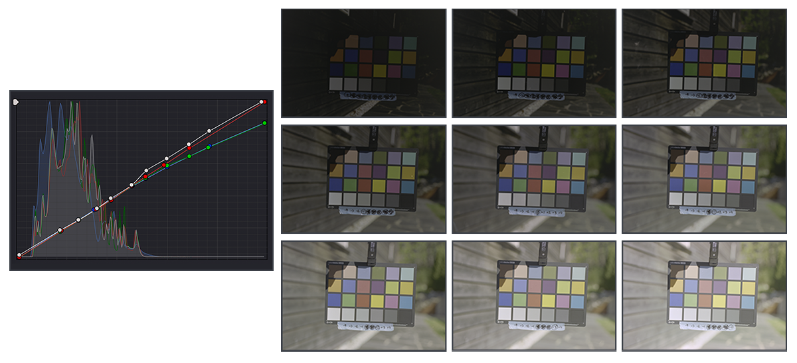
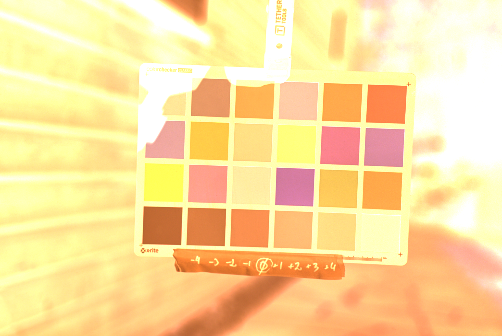
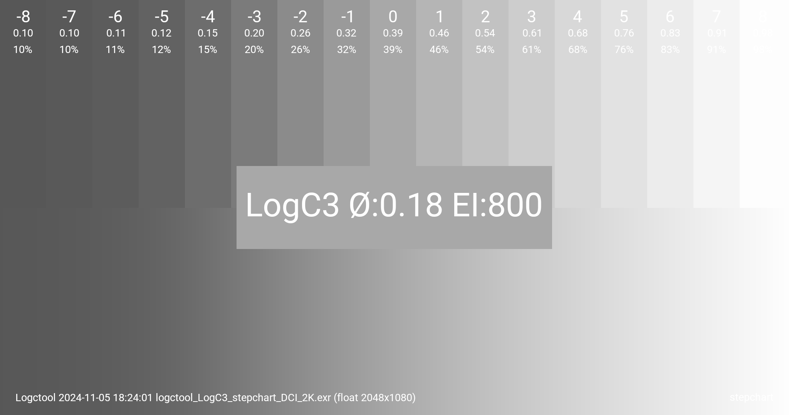

# Photographic DCTLs #

[](https://github.com/mikaelsundell/icloud-snapshot/blob/master/license.md)

- [Photographic DCTLs](#photographic-dctls)
  - [Introduction](#introduction)
  - [Installation and utils](#installation-and-utils)
    - [The run.py script](#the-runpy-script)
    - [Quick install for Windows users](#quick-install-for-windows-users)
    - [DCTL compatibility](#dctl-compatibility)
  - [Verified DCTLs](#verified-dctls)
    - [Cineon color processing](#cineon-color-processing)
      - [Cineon exposure](#cineon-exposure)
      - [Cineon inversion](#cineon-inversion)
      - [ACES scene-linear and calibration curves](#aces-scene-linear-and-calibration-curves)
      - [Cineon exposure](#cineon-exposure-1)
      - [Cineon transform](#cineon-transform)
    - [ARRI LogC color processing](#arri-logc-color-processing)
      - [LogC exposure](#logc-exposure)
      - [LogC print](#logc-print)
    - [Utilities](#utilities)
      - [Matrix](#matrix)
      - [Stripify](#stripify)
      - [Saturation](#saturation)
      - [Tonecurve](#tonecurve)
      - [Transform](#transform)
  - [Experimental DCTLs](#experimental-dctls)
      - [LogC3 temperature](#logc3-temperature)
      - [Grade](#grade)
  - [Reference charts](#reference-charts)
      - [ACES Macbeth 50D 5203 EXR from rawtoaces](#aces-macbeth-50d-5203-exr-from-rawtoaces)
      - [ARRI LogC3 stepchart - EXR 2K LogC3 encoding](#arri-logc3-stepchart---exr-2k-logc3-encoding)
      - [ARRI LogC3 colorchecker - EXR 2K LogC3 encoding](#arri-logc3-colorchecker---exr-2k-logc3-encoding)
  - [References](#references)
  - [Web Resources](#web-resources)

Introduction
---------


This collection of DCTL scripts is all about exploring and learning the math behind color science like ARRI LogC3, LogC4, ACES AP0, Gen5, and Cineon. It's a creative, photographic-inspired approach to color correction and grading, with a focus on look adjustments and classic print techniques rather than just sticking to technical workflows. The project is a work in progress, so new ideas and techniques will keep popping up. Some concepts are a bit experimental and may overlap with Resolve's built-in tools, and file names or structures might change along the way.
  
Installation and utils
---------

To use these tools into your DaVinci Resolve setup, begin by cloning the git repository or download the release package, which contains the DCTLs and headers.

Run `python(.exe) run.py install` in your terminal to copy the `*.dctl` and `*.h` files to the DaVinci Resolve LUT DCTL folder, ensuring they're accessible within your Resolve environment. The files can also be manually copied to `/Library/Application Support/Blackmagic Design/DaVinci Resolve/LUT/DCTL` on Mac and `C:\ProgramData\Blackmagic Design\DaVinci Resolve\Support\LUT\DCTL`on Windows.

For added convenience, the run.py script is provided, enabling easy access to various resources.

### The run.py script

__To open the DCTL readme documentation:__

```shell
./run.py readme
```

__For exploring DCTL examples:__

```shell
./run.py examples
```

__To access the DaVinci Resolve log file and initiate a trace:__

```shell
./run.py install
```

__To install *.dctl and *.h into DCTL directory:__

```shell
./run.py log
```

__To make a snapshot of hte DaVinvi Resolve DCTL folder:__

```shell
./run.py snapshot
```

### Quick install for Windows users

```shell
./install.bat
````

### DCTL compatibility

All DCTLs are tested and confirmed to work with Metal, CUDA, and OpenCL on both Mac and Windows platforms.

## Verified DCTLs

### Cineon color processing

#### Cineon exposure


Cineon exposure from photographic stops, incorporating a zone based false color to aid in achieving correct exposure levels.

- https://github.com/mikaelsundell/dctl/blob/master/PD-Cineon-Exposure.dctl

#### Cineon inversion


Cineon negative inversion with precise control over the dmin ratio based inversion process using adjustable parameters such as density, bit depth, offset, and density scale. You can specify dmin base values manually as floating-point numbers (obtained from tools like Pixel Analyzer in Nuke or similar software) or sample them using a rectangular sampler from the border or other dmin base areas.

#### ACES scene-linear and calibration curves

To account for the variations of film stock and the use of ECN-2 chemicals, developer time and temperature, camera and lightbox settings - calibration curves are applied to match ideal cineon code values. In this example, photoscanning was used along with the rawtoaces tool to convert the Camera RAW CR2 file to scene-linear ACES, starting with as much information as possible. However, because the science is not exact, manual tweaking using density scaling and calibration curves is needed depending on the setup.



Figure: Color calibration curves and macbeth charts at different exposures for adjustments.

- https://github.com/mikaelsundell/dctl/blob/master/PD-Cineon-Invert.dctl
- https://github.com/AcademySoftwareFoundation/rawtoaces

#### Cineon exposure

Cineon exposure from photographic stops, incorporating a zone based false color to aid in achieving correct exposure levels.

- https://github.com/mikaelsundell/dctl/blob/master/PD-Cineon-Exposure.dctl

#### Cineon transform

Cineon conversion to and from linear. 

- https://github.com/mikaelsundell/dctl/blob/master/PD-Cineon-Transform.dctl

### ARRI LogC color processing

#### LogC exposure


LogC3 exposure from photographic stops, incorporating a zone based false color to aid in achieving correct exposure levels.

- https://github.com/mikaelsundell/dctl/blob/master/PD-LogC3-Exposure.dctl

#### LogC print


Made for print emulation, this DCTL applies DaVinci Resolve's built-in film looks to ARRI LogC3 and Cineon footage with adjustable controls for luminosity and color blending.

- https://github.com/mikaelsundell/dctl/blob/master/PD-LogC3-Print.dctl

### Utilities

#### Matrix

Matrix adjustments, a utility for copying matrix values.

- https://github.com/mikaelsundell/dctl/blob/master/PD-Stripify.dctl

#### Stripify

Matrix adjustments, this DCTL simplifies the color palette by pushing colors into a warm and cool strip.

- https://github.com/mikaelsundell/dctl/blob/master/PD-Stripify.dctl

#### Saturation

HSV-based adjustments, this DCTL provides a tool for fine-tuning saturation using saturation in HSV.

- https://github.com/mikaelsundell/dctl/blob/master/PD-Saturation.dctl

#### Tonecurve

Tone curve adjustments for contrast, shoulder and toe controls.

- https://github.com/mikaelsundell/dctl/blob/master/PD-Tonecurve.dctl

#### Transform

Color space transformation to and from CIE XYZ linear.

- https://github.com/mikaelsundell/dctl/blob/master/PD-Transform.dctl

## Experimental DCTLs

#### LogC3 temperature

LogC3 CAT02 color temperature adjustments.

- https://github.com/mikaelsundell/dctl/blob/master/PD-LogC3-Temperature.dctl

#### Grade

Grade adjustments, this DCTL is experimental code for lift, gamma, gain and log controls.

- https://github.com/mikaelsundell/dctl/blob/master/PD-Grade.dctl

## Reference charts

Reference charts for testing and verifying DCTLs. Additional formats are available in the Logctool project README:

- https://github.com/mikaelsundell/logctool

#### ACES Macbeth 50D 5203 EXR from rawtoaces



- Download: [macbeth_50D_5203.exr](resources/macbeth_50D_5203.exr)

#### ARRI LogC3 stepchart - EXR 2K LogC3 encoding 



- Download: [logctool_LogC3_stepchart_DCI_2K.exr](https://mikaelsundell.s3.eu-west-1.amazonaws.com/github/logctool/logctool_LogC3_stepchart_DCI_2K.exr)

#### ARRI LogC3 colorchecker - EXR 2K LogC3 encoding 


- Download: [logctool_LogC3_colorchecker_DCI_2K.exr](https://mikaelsundell.s3.eu-west-1.amazonaws.com/github/logctool/logctool_LogC3_colorchecker_DCI_2K.exr)


References
---------

**Github projects**
* https://github.com/mikaelsundell/colortool
* https://github.com/mikaelsundell/logctool
  
**Wikipedia**
* https://en.wikipedia.org/wiki/Rec._709
* https://en.wikipedia.org/wiki/DCI-P3
* https://en.wikipedia.org/wiki/Grayscale

**Format specifications**
* http://www.dcimovies.com/archives/spec_v1_1/DCI_DCinema_System_Spec_v1_1.pdf
* https://docs.acescentral.com/specifications/acescc/#color-space
* https://www.arri.com/resource/blob/278790/dc29f7399c1dc9553d329e27f1409a89/2022-05-arri-logc4-specification-data.pdf
* https://dicomp.arri.de/digital/digital_systems/DIcompanion/index.html

**DCTLs, apps and resources**
* https://github.com/thatcherfreeman/utility-dctls
* https://github.com/AcademySoftwareFoundation/OpenRV/blob/main/src/plugins/rv-packages/additional_nodes
* https://skia.googlesource.com/skia/+/70e432e72745/gm/hsl.cpp
* https://colour.readthedocs.io
* https://github.com/ampas/aces-dev
* https://mononodes.com

**Utilities**
* https://www.desmos.com/calculator
* https://www.desmos.com/calculator/3zhzwbfrxd
* https://www.russellcottrell.com/photo/matrixCalculator.htm

 Web Resources
-------------

* GitHub page:        https://github.com/mikaelsundell/dctl
* Issues              https://github.com/mikaelsundell/dctl/issues
